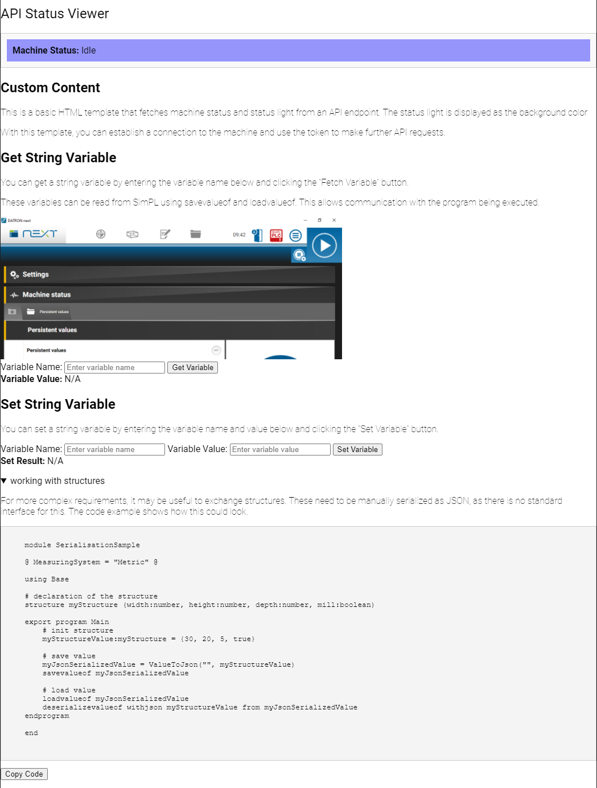

# CustomNextWebFrontend

The goal is to demonstrate how a simple web frontend can be created via the API.
Starting from version 3.5, a folder has been introduced that can serve as a "static" web root. This allows frontends to be hosted within the next API, eliminating the need to set up separate backend servers to display simple pages.

## Prerequisites

To test it, the software option "rest api automation" must be active on the machine. If this option has not been purchased, a test license can be requested. Simply contact the service.

## Installation

1. Copy the "CustomWebRoot" folder to the machine.
2. Within the management "UserSettings\DATRON Live", create a user with "API Automation" rights.

## Usage

Now, the test page can be accessed via the machine's address under the subfolder "/custom/BasicConnectionTemplate".

On this page, simple tasks can now be tested.

